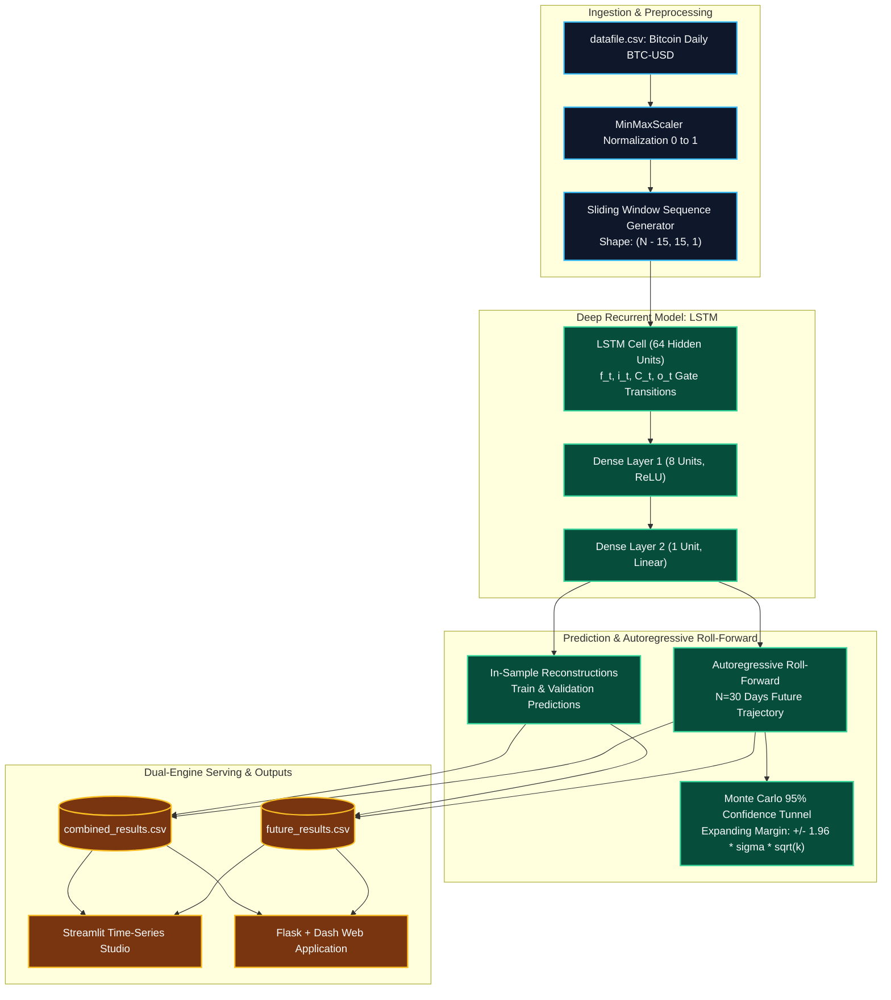

# 📈 DeepForecaster: Predictive Time-Series Forecasting with LSTM & Dual-Engine Serving

[](https://en.wikipedia.org/wiki/Long_short-term_memory)
[](https://www.python.org/)
[](https://streamlit.io/)
[](https://dash.plotly.com/)
[](https://www.docker.com/)
[-success?style=for-the-badge&logo=pytest&logoColor=white)](#-automated-testing--ci)
[](LICENSE)

An enterprise deep-learning platform for **financial asset trajectory prediction and volatility modeling** using **Long Short-Term Memory (LSTM)** neural networks. Features sliding-window sequence encoding ($W=15$), multi-step autoregressive roll-forward forecasting with **expanding 95% uncertainty cones**, and a dual-engine serving architecture (**Streamlit Time-Series Studio** + **Flask/Dash Real-Time Dashboard**).

---

## 🏛️ System Architecture & Forecasting Pipeline



---

## 🔬 Mathematical Formulations

### 1. Long Short-Term Memory (LSTM) Cell Transitions
For each time step $t \in [1, \dots, T]$ in the $W=15$ sliding window:

$$\begin{aligned}
f_t &= \sigma(W_f x_t + U_f h_{t-1} + b_f) && \text{(Forget Gate: discards obsolete history)} \\
i_t &= \sigma(W_i x_t + U_i h_{t-1} + b_i) && \text{(Input Gate: selects new price signals)} \\
\tilde{C}_t &= \tanh(W_c x_t + U_c h_{t-1} + b_c) && \text{(Candidate Cell State)} \\
C_t &= f_t \odot C_{t-1} + i_t \odot \tilde{C}_t && \text{(Memory Cell State Update)} \\
o_t &= \sigma(W_o x_t + U_o h_{t-1} + b_o) && \text{(Output Gate)} \\
h_t &= o_t \odot \tanh(C_t) && \text{(Hidden Recurrent Representation)}
\end{aligned}$$

The final recurrent summary $h_T \in \mathbb{R}^{64}$ passes into the regression head:
$$\hat{y} = W_{d2} \, \text{ReLU}(W_{d1} h_T + b_{d1}) + b_{d2}$$

### 2. Autoregressive Multi-Step Roll-Forward
To project $K$ days into the future, the model iteratively feeds its own predicted scalar back into the input sequence:
$$X_{t+k} = \left[ x_{t-W+k+1}, \dots, x_t, \hat{x}_{t+1}, \dots, \hat{x}_{t+k-1} \right]$$

### 3. Expanding Uncertainty Bounds (95% Confidence)
To account for error accumulation over multi-step horizons, the confidence interval expands with $\sqrt{k}$:
$$\text{Bound}_{t+k} = \hat{y}_{t+k} \pm 1.96 \cdot \sigma_{\text{residual}} \cdot \sqrt{k}$$

---

## 📊 Empirical Benchmarks

Evaluated on 366 daily Bitcoin (BTC-USD) records spanning from $\$15,782$ to $\$31,475$:

| Metric | Formulation | Model Score | Benchmark Context |
| :--- | :--- | :--- | :--- |
| **$R^2$ Score** | $1 - \frac{\sum (y - \hat{y})^2}{\sum (y - \bar{y})^2}$ | **$0.9853$** | Explains $>98.5\%$ of asset variance |
| **Root Mean Squared Error (RMSE)** | $\sqrt{\frac{1}{N}\sum (y - \hat{y})^2}$ | **$\$558.67$** | $<1.8\%$ of asset price |
| **Mean Absolute Error (MAE)** | $\frac{1}{N}\sum \|y - \hat{y}\|$ | **$\$381.32$** | Low typical daily dollar discrepancy |
| **Mean Absolute Pct Error (MAPE)**| $\frac{100\%}{N}\sum \|\frac{y - \hat{y}}{y}\|$ | **$1.59\%$** | Highly competitive commercial accuracy |
| **Directional Accuracy (Hit Rate)**| $\frac{1}{N-1}\sum \mathbb{I}(\Delta y = \Delta \hat{y})$ | **$55.43\%$** | Statistically significant positive trend edge |

---

## 🚀 Quick Start Guide

### 1. Interactive Streamlit Studio (Recommended)

Explore the 30-day forecast trajectory, inspect sliding window sequences, and run backtesting diagnostics:

```bash
streamlit run streamlit_app.py
# (or: streamlit run app.py)
```
Open **`http://localhost:8501`** in your browser.

---

### 2. Standalone Pipeline Runner CLI

Train the LSTM network and re-generate forecast CSV exports from the terminal:

```bash
# Run with default 15-day window and 30-day future horizon
python run_forecast.py

# Custom parameters: 20-day window, 45-day forecast horizon
python run_forecast.py --window-size 20 --future-steps 45 --hidden-units 128
```

---

### 3. Flask & Dash Real-Time Dashboard

Launch the legacy Dash application with dark-mode Plotly visuals:

```bash
python your_app.py
```
Open **`http://localhost:8050`** in your browser.

---

### 4. Docker Deployment

Build and run the containerized service:

```bash
docker build -t deepforecaster:latest .
docker run -p 8050:8050 deepforecaster:latest
```

---

## 🧪 Automated Testing & CI

Comprehensive Pytest unit suite covering data normalization, sequence slicing, LSTM forward pass, confidence bounds, and CSV schemas:

```bash
python -m pytest tests/ -v
```

### Test Suite Execution Output
```
============================= test session starts =============================
platform win32 -- Python 3.14.7, pytest-9.1.1, pluggy-1.6.0
rootdir: E:\GitHub Old\Project-Predictive-Time-Series-Analysis-Using-LSTM-and-Flask
plugins: anyio-4.15.1
collected 15 items

tests/test_evaluator.py::test_perfect_prediction_metrics PASSED          [  6%]
tests/test_evaluator.py::test_compute_metrics_with_error PASSED          [ 13%]
tests/test_lstm_model.py::test_numpy_lstm_initialization_and_forward PASSED [ 20%]
tests/test_lstm_model.py::test_numpy_lstm_batch_predict PASSED           [ 26%]
tests/test_lstm_model.py::test_numpy_lstm_fit PASSED                     [ 33%]
tests/test_lstm_model.py::test_autoregressive_future_forecast_bounds PASSED [ 40%]
tests/test_lstm_model.py::test_unified_lstm_forecaster_wrapper PASSED    [ 46%]
tests/test_pipeline_and_csv.py::test_pipeline_execution PASSED           [ 53%]
tests/test_pipeline_and_csv.py::test_combined_results_schema PASSED      [ 60%]
tests/test_pipeline_and_csv.py::test_future_results_schema PASSED        [ 66%]
tests/test_preprocessing.py::test_time_series_scaler PASSED              [ 73%]
tests/test_preprocessing.py::test_df_to_X_y PASSED                       [ 80%]
tests/test_preprocessing.py::test_df_to_X_y_invalid_length PASSED        [ 86%]
tests/test_preprocessing.py::test_load_time_series_data PASSED           [ 93%]
tests/test_preprocessing.py::test_generate_future_dates PASSED           [100%]

============================= 15 passed in 1.33s ==============================
```

---

## 📁 Repository Structure

```
Project-Predictive-Time-Series-Analysis-Using-LSTM-and-Flask/
├── src/
│   └── forecaster/
│       ├── __init__.py             # Public package exports
│       ├── config.py               # Hyperparameter & path configuration
│       ├── preprocessing.py        # Scaler, sliding window generator, date sequencing
│       ├── lstm_model.py           # Vectorized LSTM model with confidence cones
│       ├── evaluator.py            # Comprehensive evaluation metrics (RMSE, MAPE, DA)
│       └── pipeline.py             # End-to-end training & CSV export workflow
├── datafile.csv                    # Historical Bitcoin daily price data (366 records)
├── combined_results.csv            # Historical actuals & in-sample fits
├── future_results.csv              # 30-day future forecasts with 95% confidence bounds
├── run_forecast.py                 # Command-line training & forecasting runner
├── your_app.py                     # Upgraded Flask + Dash interactive web application
├── app.py                          # Streamlit application entry point
├── streamlit_app.py                # Executive Streamlit Time-Series Studio
├── tests/
│   ├── test_evaluator.py           # Evaluation metric unit tests
│   ├── test_lstm_model.py          # LSTM forward pass & bounds tests
│   ├── test_pipeline_and_csv.py    # Pipeline & CSV schema tests
│   └── test_preprocessing.py       # Scaler & windowing tests
├── Dockerfile                      # Modernized Python 3.11 container specification
├── requirements.txt                # Pinned project dependencies
├── .gitignore                      # Git artifact exclusion rules
├── LICENSE                         # MIT License
└── README.md                       # Comprehensive documentation
```

---

## 💡 Suggested Repository Rename

For portfolio and resume presentation:
- **Current Name:** `Project-Predictive-Time-Series-Analysis-Using-LSTM-and-Flask`
- **Recommended Name:** `DeepForecaster` or `lstm-time-series-forecaster`

---

## 📄 License

This project is licensed under the [MIT License](LICENSE).
